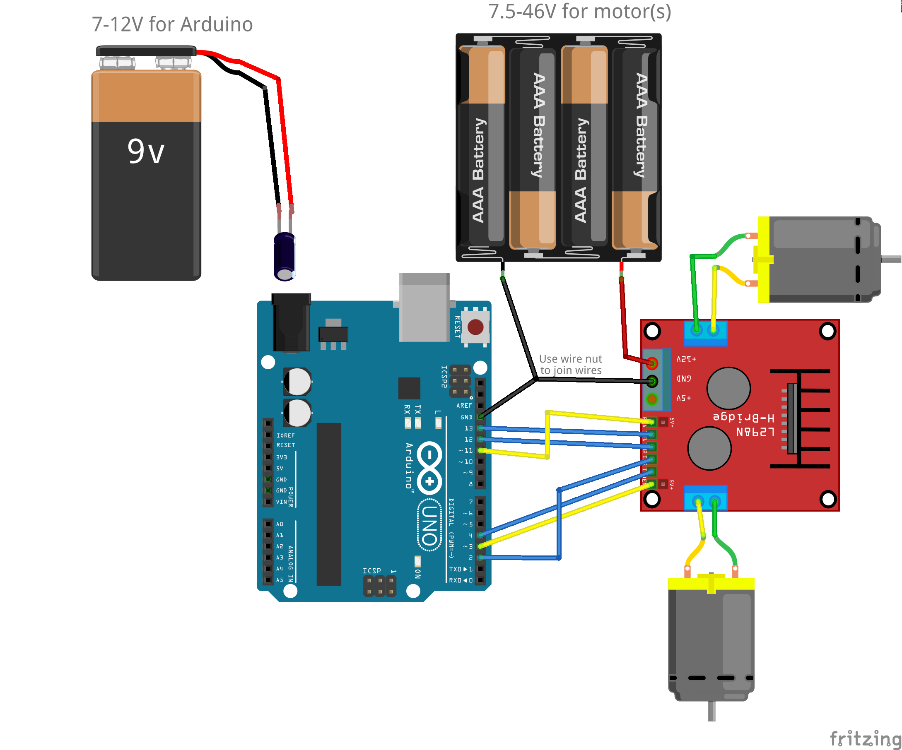

# Arduino Tutorial: Controlling motors from Arduino

## General suggestions
1. Always use separate power supplies for the Arduino and the motors to avoid
any possibility of the motor affecting the proper operation of your Arduino.

2. Check the specifications of your motor controller to determine what voltage
range is appropriate. For example the Adafruit Motor Shield V2 is specified
for motor voltages between 5-12V while the L298 IC is rated for 7.5-46V.

3. You can power your Arduino either using a USB cable (e.g. from a
rechargable USB battery) or the DC barrel jack on the Arduino. If you provide
power through the DC power jack it must be in the range of 7-12v. It is
possible that your Arduino might run at a lower voltage but this is not
guaranteed to work and is unreliable.

## Using an Adafruit Motor Shield V2

1. Always remove the VIN jumper (which provides Arduino power from the motor
power supply) on the Adafruit Motor
Shield V2. This jumper would be on the two pins next to the motor power
screw terminals, so if you see two bare pins there the jumper has been
removed.

Adafruit motor shield V2
[tutorial](https://learn.adafruit.com/adafruit-motor-shield-v2-for-arduino?view=all)

## Using a generic H-bridge module based on an L298 IC

1. This circuit is representative of the L298 modules, although they may vary
from manufacturer to manufacturer.

L298 [Data Sheet]
(https://www.sparkfun.com/datasheets/Robotics/L298_H_Bridge.pdf)
